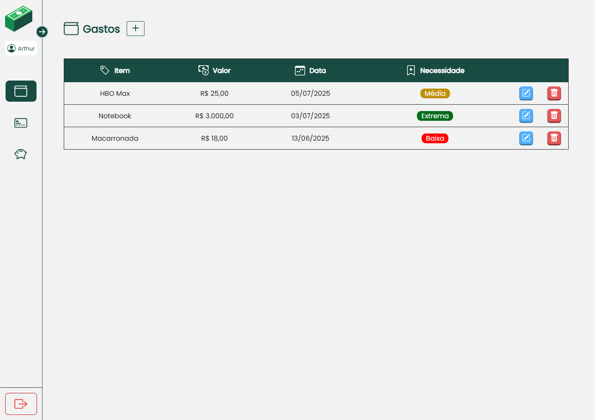
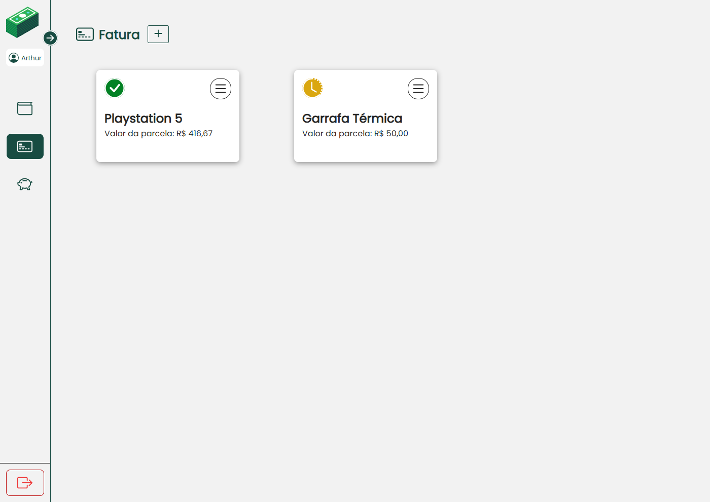
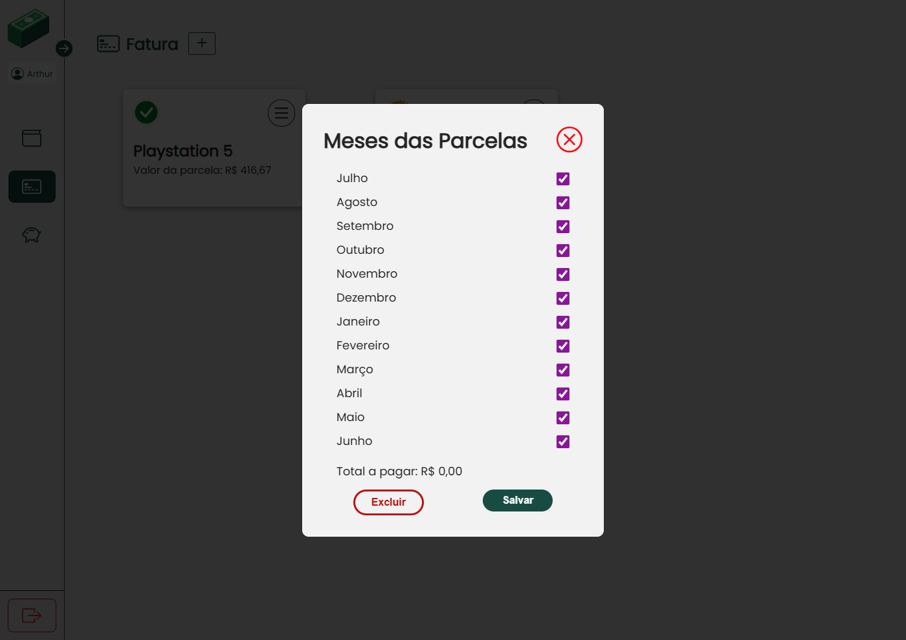
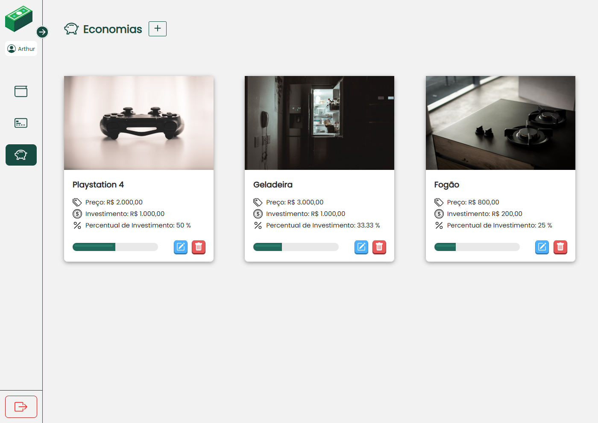
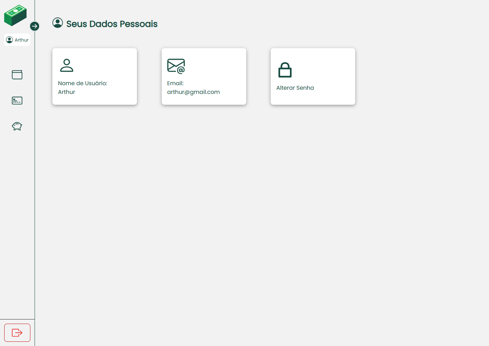

# 💸MyFinances

Sistema desenvolvido com intuito de promover controle de gastos, itens de fatura e economias.

## 🛠️ Tecnologias:
 	

## 🌟 Funcionalidades
- Controle dos Gastos e seus respectivos graus de necessidade para o usuário.
- Meses das parcelas de um item da fatura adicionados automaticamente a partir da data e a quantidade das parcelas indicadas pelo usuário no cadastro.
- Verificação do status do item da fatura(pago ou em andamento) e  status das parcelas (paga ou em aberto) e a possível edição do status.
- Cadastro de Economias e seus respectivos valores de objetivos a serem alcançados, quantidade investida e percentual investido.

## 💻 Demonstração:

## 📄 Atribuições:
[Money icons created by Chanut-is-Industries - Flaticon](https://www.flaticon.com/free-icons/money")

